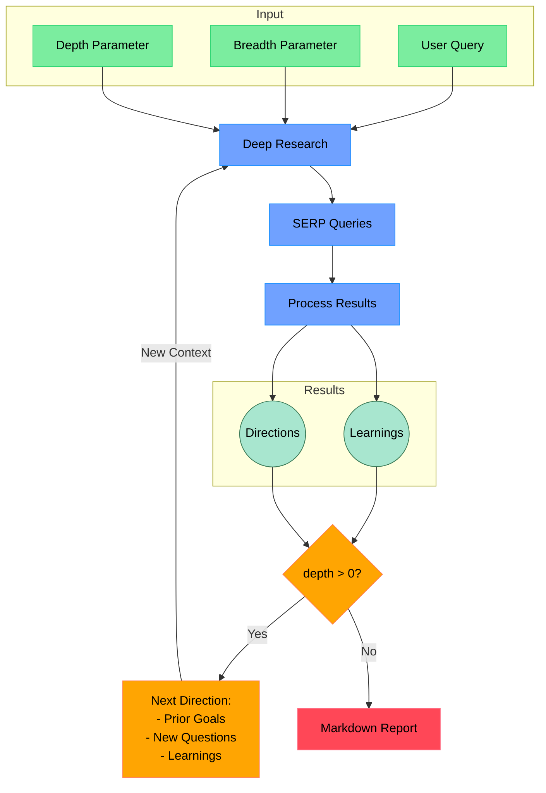

# Erevna AI Research Assistant

A modern, interactive web interface and intuitive research assistant. Erevna AI Research Assistant is a free, alternative to OpenAI's Deep Research, Google's Gemini, and Anthropic's Claude Research. Powered by o3-mini, this advanced AI research assistant delivers comprehensive market analysis, competitive intelligence, and academic research capabilities. Experience enterprise-grade research automation with features like recursive exploration, multi-source validation, and structured insights extraction. Perfect for startups, researchers, and businesses seeking a transparent, customizable, and powerful research solution without vendor lock-in. Dive deep into any topic with our state-of-the-art natural language processing and automated insight generation. It combines search engines (via FireCrawl), web scraping, and language models (via OpenAI) to perform deep research on any topic.


## How It Works


## Features

The system combines search engines (via FireCrawl), web scraping, and language models (via OpenAI) to perform deep research on any topic. Key features include:

- **Intelligent Research Process:**
  - Advanced Recursive Analysis:
    - Automatically explores topics in-depth through iterative research cycles
    - Identifies and investigates related subtopics and connections
    - Adapts research paths based on discovered information
  - Smart Query Generation:
    - Leverages LLMs to create context-aware search queries
    - Optimizes searches based on research goals and prior findings
  - Parallel Processing:
    - Handles multiple research threads simultaneously
    - Efficiently processes and synthesizes information from various sources
  - Customizable Parameters:
    - Adjustable depth for controlling recursive exploration levels
    - Configurable breadth for managing search scope and coverage

- **Research Output:**
  - Comprehensive Documentation:
    - Structured markdown reports with detailed findings
    - Full source attribution and citations
    - Hierarchical organization of discovered information
  - Progress Monitoring:
    - Real-time tracking of research progress
    - Visual indicators for active research paths
    - Interactive markdown preview
  - Export Options:
    - Downloadable reports in multiple formats
    - Preserves formatting and source links

- **Modern Interface:**
  - User Experience:
    - Intuitive parameter controls
    - Real-time visual feedback
    - Progress indicators and status updates
  - Security:
    - Secure API key management
    - HTTP-only cookie implementation
    - Protected credential storage


### Installation

1. **Clone and Install**

   ```bash
   git clone https://github.com/inakirod/erevnaai.git
   cd erevnaai
   npm install
   ```

2. **Configure Environment**

   Create `.env.local` and add:

   ```bash
   OPENAI_API_KEY=your-openai-api-key
   FIRECRAWL_KEY=your-firecrawl-api-key
   NEXT_PUBLIC_ENABLE_API_KEYS=false  # Set to false to disable API key dialog
   ```

3. **Run the App**
   ```bash
   npm run dev
   ```
   Visit [http://localhost:3000](http://localhost:3000)

## API Key Management

By default (`NEXT_PUBLIC_ENABLE_API_KEYS=true`), the app includes an API key input dialog that allows users to try out Erevna research assistant directly in their browser using their own API keys. Keys are stored securely in HTTP-only cookies and are never exposed to client-side JavaScript.

For your own deployment, you can disable this dialog by setting `NEXT_PUBLIC_ENABLE_API_KEYS=false` and configure the API keys directly in your `.env.local` file instead.

## License

MIT License. Feel free to use and modify the code for your own projects as you wish.

## Acknowledgements

- **Tools:** Next.js, shadcn/ui, anotherwrapper, Vercel AI SDK

Happy researching!
